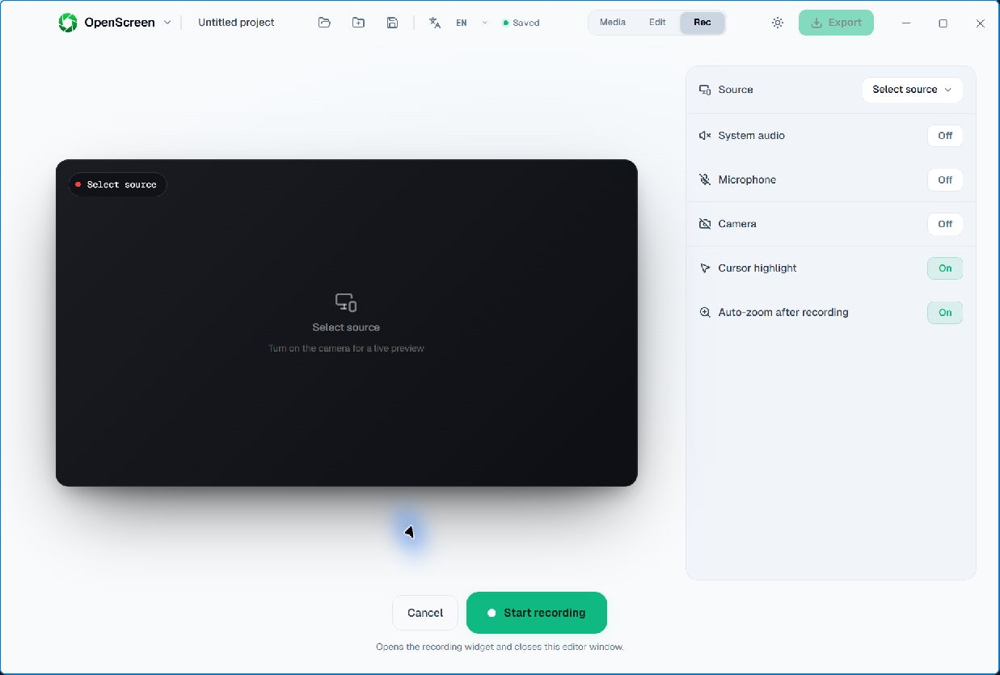

# Recording defaults: Windows validation

The settings implementation was tested on Windows 11 in a source-built OpenScreen 1.11.0 with an isolated profile on 2026-09-13. The tested integration included the settings changes and the GIF/workbench changes that were subsequently split into separate PRs. This record is not a claim that the split PR was run through a second complete hardware pass.

- Screen, system audio, microphone, webcam and combined recording opened in the editor. Playback, seeking and trimming were exercised with real OS input.
- Recording preferences survived a full process restart. An explicitly selected microphone was restored; the camera used the default device, so explicit camera-ID persistence is not claimed by this pass.
- Reset recording setup, with the recording page already mounted, immediately turned system audio, microphone and camera off, stopped both device previews and cleared the active source. This retest followed the fix for stale recording-page state.
- Resetting appearance defaults left six existing project files unchanged. A new project created through the UI used the factory wallpaper, shadow, padding, motion blur and cursor defaults on its first write.
- A selected test window was closed before restarting the app. The recording page remained unselected after source validation rather than selecting a different window. The durable descriptor was retained for future matching.

The screenshot shows the recording page after reset. No microphone/camera preview, device identity, private media or filesystem path is visible.

The final synchronization repair passed targeted Vitest tests for recording preferences, RecStage, browser-shim events and LaunchWindow, both application/test TypeScript checks, scoped Biome checks, i18n validation and `npm run build-vite`.

Not covered: STT (helper absent), HUD pointer hit-testing, tray behavior, precise audiovisual synchronization, exhaustive editor operations, macOS/Linux hardware testing or release packaging. This is a scoped Windows result, not release promotion approval. Earlier failed attempts remain separate historical records.
